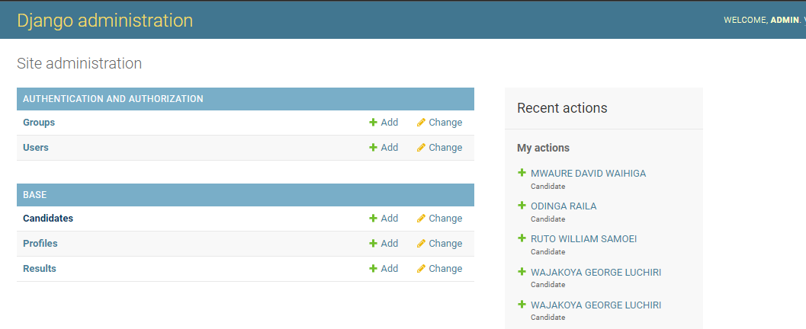

# Elections-Tallying-System(UCHAGUZI APP)
# NATION DECIDES
Nation Decides is a web application that allows users to easily access the results of an election when the presiding officer posts the results. A user just loads the system and the results will be dynamically updated when every presiding officer posts there respective constituency results. 
***

## Deliverables
The objective is to build an elections tallying system.
On the admin side, the administrator should be able to create presiding officers (PO). 
These POs should then be able to login into the system and submit results of their polling stations. 
The admin should also be able to create a polling station. Eventually, we can tally the results of the elections once entered by the PO and display it on the front end.
## TABLE OF CONTENTS
- [Deliverables](#deliverables)
- [Technologies Used](#technologies-used)
- [Features](#features)
- [Requirements](#requirements)
- [Installation Guide](#installation-guide)
- [Developer](#developer)
***
## Technologies Used
- Python 
- Django
- Sqlite Database
- Html/Css/Bootstrap
***
## Features
Modules Include-:
1.Admin module
2.Presiding officer(PO) Module
3.User Module

The Admin of the system creates or adds presiding officer to the system and provides them with the login credentials to the officers dashboard. Also the admin assigns the officers with specific constituency for them to post results


The presiding officer using the credentials provided by the admin logs in to the system where they now enter the resuts of the constituency they have been assigned to.


The user doesnt have to login they just load the website and the site dynamically updates when every (PO) officer adds the results of their constituency.


***
## Requirements
To run this application, the user needs to have python3 installed in their system. They can download it [here](https://www.python.org/downloads/release/python-3108/).
***
## Installation Guide
To run this application, you first need to create a directory:
```bash
mkdir 'your directory'
```
Enter your directory and create a virtual environment:
```bash
pip install virtualenv
python3.10 -m venv env
```
Activate the virtual environment:
```bash
source env\bin\activate
```
clone the repository
```bash
git clone https://github.com/evanskiprotich/Elections-Tallying-System.git
```
Install the requirements
```bash
pip install -r requirements.txt
```
Enter the directory
```bash
cd Election-Tallying-System
```
Inside settings.py scroll down to the bottom and install the Email settings with yours.
Make migrations with this command in the terminal
```bash
python manage.py makemigrations
python manage.py migrate
```
Create a superuser running this command in the terminal
```bash
python manage.py createsuperuser
```
Run the app
```bash
python manage.py runserver
```

## Developer
EVANS KIPROTICH KIPNGETICH